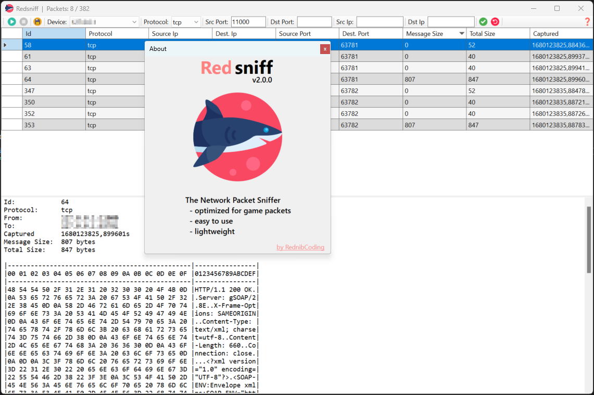

# RedSniff
The Network Game Packet Sniffer
 - optimized for game packets
 - easy to use
 - lightweight

# Runtime Dependencies
Like Wireshark, Redsniff also depends on `Npcap` for Windows

So in order to use Redsniff you have to download and install `Npcap` for Windows: https://npcap.com/

# Prebuild binaries
You can find prebuild binaries for Windows in the `Output` folder